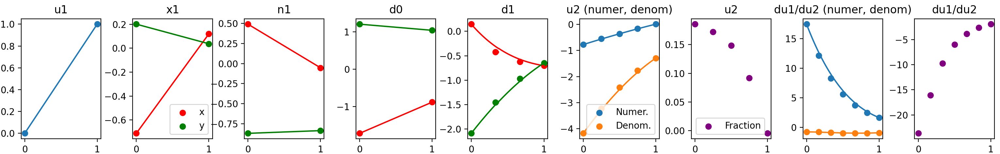

# bound-caustics
Code for SIGGRAPH 2025 (ToG) paper "Bernstein Bounds for Caustics"

[Paper](https://zhiminfan.work/paper/bound_caustics_preprint.pdf)

## Reproduce

- Fig. 09: `2d/fig09`. Run `run_main_top/bottom.py`. You can choose the `_latex` variant to generate the paper figure, which however needs a latex environment. 

    - To visualize the computation process of polynomials expressed in Bernstein basis, please try `2d/mid/run_main.py`. We show the polynomials (curves) and their control points (dots).

